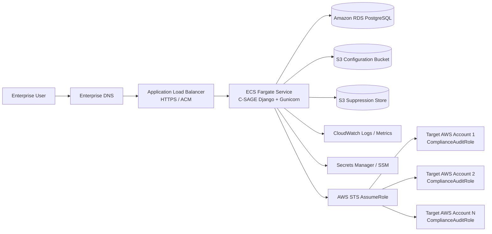

# C-SAGE Deployment Guide

**Platform:** C-SAGE — Cloud Security, Audit, Governance & Enforcement  
**Application Type:** AWS Multi-Account Cloud Compliance & Governance Tool  
**Runtime:** Python 3.11 / Django 5.x / Gunicorn  
**Container:** Single Docker container  
**Recommended Production Platform:** Amazon ECS on AWS Fargate behind an Application Load Balancer (ALB)

---

## 1. Purpose

This document describes how to deploy C-SAGE in an enterprise AWS environment. It covers local validation, container build and publishing, AWS networking, IAM, S3 configuration, cross-account access, PostgreSQL/RDS, ECS Fargate, ALB/HTTPS, secrets, logging, monitoring, validation, rollback, and operational controls.

C-SAGE is designed to run in a central governance/security AWS account and audit one or more target AWS accounts by assuming a dedicated `ComplianceAuditRole` in each account.

---

## 2. Recommended Production Architecture



### Recommended placement

- Deploy C-SAGE in a dedicated **Security**, **Cloud Governance**, or **Cloud CCoE** AWS account.
- Run ECS tasks in **private subnets** across at least two Availability Zones.
- Place the ALB in the required ingress tier according to enterprise network standards.
- Restrict direct access to ECS tasks. Only the ALB security group should be permitted to reach the application port.
- Use HTTPS only for production access.

---

## 3. Repository Artifacts Used for Deployment

| Artifact | Purpose |
|---|---|
| `Dockerfile` | Builds the production C-SAGE image and runs Gunicorn on port `8000`. |
| `.env.example` | Documents supported runtime configuration variables. |
| `accounts.example.json` | Example multi-account S3 configuration structure. |
| `iam/CSAGEExecutionRolePolicy.json` | Baseline permissions for the central C-SAGE workload role. |
| `iam/ComplianceAuditRolePolicy.json` | Baseline read-only audit permissions for target accounts. |
| `docker-compose.yml` | Lightweight local/container validation. |
| `docs/ARCHITECTURE.md` | Application architecture. |
| `docs/CONTROL_CATALOG.md` | Compliance control catalog. |

---

## 4. Prerequisites

Before deployment, ensure the following are available:

1. AWS account selected for hosting C-SAGE.
2. VPC with at least two private application subnets in separate Availability Zones.
3. ALB-capable ingress subnets if the ALB is internet-facing, or private ingress subnets for an internal ALB.
4. Amazon ECR repository for the C-SAGE image.
5. ECS cluster using Fargate.
6. S3 bucket for multi-account configuration.
7. S3 bucket or approved prefix for suppressed finding persistence.
8. IAM execution/task role for the C-SAGE workload.
9. `ComplianceAuditRole` deployed in every target AWS account.
10. ACM certificate for the production C-SAGE hostname.
11. Route 53 or enterprise DNS record for the application.
12. PostgreSQL database for production deployments.
13. Secrets Manager or SSM Parameter Store for sensitive settings.
14. Network connectivity to AWS public service endpoints, NAT gateway, enterprise egress, or required VPC endpoints.

### Required local tools for deployment administration

```text
Docker
AWS CLI v2
Git
```

Optional:

```text
psql
jq
AWS Session Manager plugin
```

---

## 5. Runtime Environment Variables

Start from `.env.example`.

### Core Django settings

```text
DJANGO_DEBUG=false
DJANGO_SECRET_KEY=<strong-random-secret>
DJANGO_ALLOWED_HOSTS=c-sage.example.icicibank.com
DJANGO_CSRF_TRUSTED_ORIGINS=https://c-sage.example.icicibank.com
DATABASE_URL=postgresql://<user>:<password>@<rds-endpoint>:5432/<database>
```

> Do not store production passwords or `DJANGO_SECRET_KEY` in source control. Inject them into the ECS task from AWS Secrets Manager or SSM Parameter Store.

### AWS multi-account configuration

```text
AWS_DEFAULT_REGION=ap-south-1
COMPLIANCE_CONFIG_S3_BUCKET=<configuration-bucket>
COMPLIANCE_CONFIG_S3_KEY=aws-compliance-config/accounts.json
```

### Suppression persistence

```text
SUPPRESSION_S3_BUCKET=<suppression-bucket>
SUPPRESSION_S3_KEY=suppressed_findings.json
```

### Compliance policy settings

```text
CSAGE_MAX_WORKERS=8
CSAGE_EOL_WARNING_DAYS=30
CSAGE_ACCESS_KEY_MAX_AGE_DAYS=90
CSAGE_KMS_MAX_AGE_DAYS=365
CSAGE_ALLOWED_EMAIL_DOMAIN=icicibank.com
CSAGE_SENSITIVE_PORTS=22,3389,1433,1521,3306,5432,6379,9200,27017
CSAGE_BACKUP_MAX_AGE_HOURS=24
CSAGE_BACKUP_MIN_RETENTION_DAYS=7
CSAGE_DEPRECATED_LAMBDA_RUNTIMES=python3.7,python3.8,nodejs14.x,nodejs16.x
```

### Gunicorn tuning

The Docker image supports:

```text
GUNICORN_WORKERS=3
GUNICORN_THREADS=4
GUNICORN_TIMEOUT=300
```

Tune these values only after observing memory, CPU, scan duration, and concurrent user load.

---

## 6. Multi-Account Configuration in S3

Create the configuration object at the configured bucket/key.

Example:

```json
{
  "accounts": [
    {
      "account_id": "111122223333",
      "account_name": "Production",
      "role_arn": "arn:aws:iam::111122223333:role/ComplianceAuditRole",
      "regions": ["ap-south-1", "ap-south-2"]
    },
    {
      "account_id": "444455556666",
      "account_name": "UAT",
      "role_arn": "arn:aws:iam::444455556666:role/ComplianceAuditRole",
      "regions": ["ap-south-1"]
    }
  ]
}
```

Upload it:

```bash
aws s3 cp accounts.json \
  s3://<configuration-bucket>/aws-compliance-config/accounts.json
```

Recommended S3 controls:

- Block Public Access: enabled.
- SSE-KMS encryption with an approved customer-managed KMS key.
- Bucket versioning: enabled.
- Object access logging / CloudTrail data events according to enterprise policy.
- Restrict access to the C-SAGE task role and authorized administrators.

If the configuration S3 bucket/key is not configured or cannot be read, C-SAGE falls back to the default Boto3 credential chain and audits using the IAM identity attached directly to the workload.

---

## 7. Cross-Account IAM Configuration

### 7.1 Central C-SAGE task role

Create an ECS task role such as:

```text
CSAGEApplicationRole
```

Use `iam/CSAGEExecutionRolePolicy.json` as the baseline and restrict resources to:

- Approved configuration S3 object/prefix.
- Approved suppression S3 object/prefix.
- Approved target `ComplianceAuditRole` ARNs.

The central role requires `sts:AssumeRole` to the target audit roles.

### 7.2 Target account audit role

Deploy the following role in every audited AWS account:

```text
ComplianceAuditRole
```

Attach the baseline permissions from:

```text
iam/ComplianceAuditRolePolicy.json
```

Configure the trust policy so that only the approved C-SAGE workload role can assume it.

Example trust policy:

```json
{
  "Version": "2012-10-17",
  "Statement": [
    {
      "Effect": "Allow",
      "Principal": {
        "AWS": "arn:aws:iam::<CSAGE_ACCOUNT_ID>:role/CSAGEApplicationRole"
      },
      "Action": "sts:AssumeRole"
    }
  ]
}
```

Enterprise hardening options include:

- AWS Organizations-based conditions where appropriate.
- `aws:PrincipalArn` restrictions.
- External ID if required by the enterprise trust model.
- Permission boundaries and SCP alignment.
- CloudTrail monitoring for all `AssumeRole` activity.

---

## 8. PostgreSQL / Amazon RDS Deployment

SQLite is suitable for development only. Use PostgreSQL for production.

Recommended baseline:

- Amazon RDS for PostgreSQL or Aurora PostgreSQL-compatible.
- Multi-AZ for production.
- Storage encryption using an approved customer-managed KMS key.
- Automated backup retention aligned to enterprise policy.
- Deletion protection enabled.
- TLS enforced where supported by the database configuration.
- Database accessible only from the C-SAGE ECS task security group.
- Credentials stored in Secrets Manager.

Create the database and application user according to the enterprise DBA standard, then configure:

```text
DATABASE_URL=postgresql://csage_app:<password>@<endpoint>:5432/csage
```

The current container startup command executes:

```bash
python manage.py migrate --noinput
```

before starting Gunicorn. For larger production environments, a controlled one-off ECS migration task before application rollout is preferable so schema migration is separated from horizontal application scaling.

---

## 9. Build the Docker Image

From the repository root:

```bash
docker build -t c-sage:latest .
```

Validate locally:

```bash
docker run --rm \
  -p 8000:8000 \
  --env-file .env \
  c-sage:latest
```

Health check:

```bash
curl http://localhost:8000/healthz/
```

The container exposes port `8000` and includes an internal Docker health check against `/healthz/`.

---

## 10. Push the Image to Amazon ECR

Create the repository once:

```bash
aws ecr create-repository \
  --repository-name c-sage \
  --image-scanning-configuration scanOnPush=true
```

Authenticate Docker:

```bash
aws ecr get-login-password --region ap-south-1 | \
  docker login \
  --username AWS \
  --password-stdin <ACCOUNT_ID>.dkr.ecr.ap-south-1.amazonaws.com
```

Tag and push:

```bash
docker tag c-sage:latest \
  <ACCOUNT_ID>.dkr.ecr.ap-south-1.amazonaws.com/c-sage:<VERSION>

docker push \
  <ACCOUNT_ID>.dkr.ecr.ap-south-1.amazonaws.com/c-sage:<VERSION>
```

Use immutable release tags such as a Git commit SHA or semantic version. Avoid relying only on `latest` for production deployments.

---

## 11. ECS Fargate Deployment

### 11.1 ECS cluster

Create or use a dedicated cluster, for example:

```text
c-sage-prod
```

### 11.2 Task definition baseline

Recommended initial sizing:

```text
CPU:    1024 units
Memory: 2048–4096 MiB
Port:   8000/TCP
```

Increase sizing based on account count, region count, resource volume, and concurrent scan workload.

Configure:

- Launch type / capacity provider: Fargate.
- Platform version: current approved version.
- Task role: `CSAGEApplicationRole`.
- Task execution role: standard ECS execution role with ECR pull and CloudWatch Logs access.
- Read-only root filesystem where compatible with the application runtime.
- CloudWatch Logs using `awslogs`.
- Secrets injected from Secrets Manager / SSM.
- Environment variables injected from the task definition or approved configuration source.

### 11.3 ECS service

Recommended production baseline:

```text
Desired count: 2
Minimum:       2
Maximum:       based on validated scaling policy
```

Deploy tasks across at least two Availability Zones.

For an initial PoC, desired count `1` is acceptable. Production should use multiple tasks only after database migrations, suppression updates, and scan concurrency have been validated for multi-task execution.

---

## 12. Application Load Balancer and HTTPS

Create an ALB target group:

```text
Target type: IP
Protocol: HTTP
Port: 8000
Health check path: /healthz/
Success code: 200
```

Recommended health-check settings:

```text
Interval: 30 seconds
Timeout: 5 seconds
Healthy threshold: 2
Unhealthy threshold: 3
```

Create an HTTPS listener on port `443` using an ACM certificate.

Redirect port `80` to HTTPS or do not expose port `80`, according to the approved ingress model.

### Security groups

**ALB security group**

- Inbound: HTTPS `443` from approved enterprise ranges / ingress tier.
- Outbound: TCP `8000` to C-SAGE ECS task security group.

**ECS task security group**

- Inbound: TCP `8000` from ALB security group only.
- Outbound: HTTPS `443` to AWS services through approved egress, endpoints, or NAT.
- Outbound to PostgreSQL port `5432` toward the RDS security group.

**RDS security group**

- Inbound: PostgreSQL `5432` from C-SAGE ECS task security group only.

---

## 13. DNS and Application Security Settings

Create an enterprise DNS record such as:

```text
c-sage.<approved-domain>
```

Point it to the ALB.

Configure Django:

```text
DJANGO_ALLOWED_HOSTS=c-sage.<approved-domain>
DJANGO_CSRF_TRUSTED_ORIGINS=https://c-sage.<approved-domain>
DJANGO_DEBUG=false
```

For production, integrate the application with the enterprise SSO / reverse proxy authentication pattern before broad user exposure.

Recommended additional edge controls:

- AWS WAF on the ALB where required.
- Enterprise IP allow-listing.
- TLS policy aligned with bank cryptographic standards.
- Access logs for ALB.
- Centralized security monitoring.

---

## 14. AWS Service Connectivity

C-SAGE calls multiple AWS APIs. ECS tasks therefore require network access to AWS service endpoints.

Possible connectivity models:

1. NAT gateway / approved centralized egress.
2. AWS PrivateLink / VPC interface endpoints for supported AWS services.
3. Gateway endpoints for S3 where appropriate.

At minimum validate connectivity to:

- STS
- S3
- EC2
- IAM
- ACM
- RDS
- EFS
- Backup
- DynamoDB
- Lambda
- KMS
- SNS
- Budgets
- EKS
- OpenSearch
- ElastiCache
- Resource Groups Tagging API
- AWS Config, when inventory discovery uses AWS Config

A fully private endpoint-only architecture may require several interface endpoints because C-SAGE audits a broad service set.

---

## 15. Initial Application Bootstrap

After the database is reachable, run migrations:

```bash
python manage.py migrate
```

Create the initial administrator:

```bash
python manage.py createsuperuser
```

For ECS, run these commands using a one-off task or ECS Exec according to enterprise operational policy.

Then populate lifecycle/EOL records in the Django Admin `LifecycleRule` table.

---

## 16. Deployment Validation Checklist

### Platform validation

- [ ] ECS task starts successfully.
- [ ] ECS service reaches steady state.
- [ ] ALB target reports healthy.
- [ ] `/healthz/` returns HTTP `200`.
- [ ] HTTPS certificate is valid.
- [ ] HTTP is disabled or redirected to HTTPS.
- [ ] Application login works.
- [ ] CloudWatch application logs are visible.

### Database validation

- [ ] Django migrations completed successfully.
- [ ] C-SAGE can persist scan runs and findings.
- [ ] Database connection is encrypted according to the approved design.
- [ ] RDS is not publicly accessible.

### AWS access validation

- [ ] C-SAGE can read the accounts configuration object from S3.
- [ ] C-SAGE can read/write the suppression object as required.
- [ ] Central task role can assume each target `ComplianceAuditRole`.
- [ ] Target audit role cannot perform unauthorized write operations.
- [ ] CloudTrail records role assumption events.

### Functional validation

- [ ] Dashboard loads successfully.
- [ ] `Run Audit Scan` completes against a test account.
- [ ] Account name and account ID are displayed correctly.
- [ ] Compliance findings are persisted.
- [ ] Suppress / Unsuppress works.
- [ ] Suppressed findings remain auditable and are excluded from open non-compliance totals.
- [ ] CSV export works.
- [ ] Excel export works.
- [ ] Inventory export works.
- [ ] Account, service, status, and keyword filters work.
- [ ] Accessibility `A-`, `A`, and `A+` controls work.

---

## 17. Logging and Monitoring

Send container stdout/stderr to CloudWatch Logs.

Recommended log group:

```text
/aws/ecs/c-sage
```

Recommended alarms:

- ECS running task count below desired count.
- ALB unhealthy host count > 0.
- ALB HTTP 5xx threshold breached.
- Target response time degradation.
- ECS CPU high.
- ECS memory high.
- RDS CPU / storage / connection threshold breached.
- Application scan failures above threshold.

Retain logs according to enterprise and audit policy.

For security investigations, correlate:

- ALB access logs.
- C-SAGE application logs.
- CloudTrail `AssumeRole` events.
- S3 data events for configuration/suppression objects where enabled.
- RDS audit/database logs according to the database standard.

---

## 18. Secrets and Sensitive Data Handling

Never commit the following to Git:

- Django secret key.
- Database passwords.
- AWS access keys.
- Session credentials.
- Private certificates/keys.

Use ECS secret injection from AWS Secrets Manager or SSM Parameter Store.

C-SAGE should use IAM roles rather than long-lived AWS access keys.

---

## 19. Scaling Guidance

Compliance scans are API-intensive. Scale carefully to avoid AWS API throttling.

Primary tuning controls:

```text
CSAGE_MAX_WORKERS
GUNICORN_WORKERS
GUNICORN_THREADS
```

Guidance:

- Increase scanner concurrency gradually.
- Monitor AWS throttling errors.
- Use exponential backoff/retry behavior provided by the AWS SDK.
- Avoid scaling ECS tasks purely to accelerate scans until cross-task scan coordination is validated.
- Prefer controlled concurrency within a task for the current architecture.

---

## 20. Backup and Recovery

### RDS

- Enable automated backups.
- Enable PITR according to the chosen RDS engine capability.
- Use Multi-AZ for production.
- Test restore procedures periodically.

### S3 configuration and suppression data

- Enable bucket versioning.
- Use customer-managed KMS encryption.
- Consider Object Lock only if mandated by audit requirements and lifecycle behavior is fully validated.

### Application container

The application image is immutable and should be recoverable from ECR using its release tag/digest.

---

## 21. Upgrade Procedure

1. Pull the approved application revision.
2. Run unit/system checks.
3. Build a new Docker image.
4. Scan the image for vulnerabilities.
5. Push the immutable release image to ECR.
6. Review database migrations.
7. Run migration as a controlled one-off task where required.
8. Register a new ECS task definition revision.
9. Deploy using ECS rolling deployment or the approved blue/green strategy.
10. Validate `/healthz/`, login, dashboard, and a test scan.
11. Monitor error rate and target health.
12. Close the change ticket with implementation evidence.

---

## 22. Rollback Procedure

If the new deployment fails:

1. Stop the rollout or update the ECS service to the previously approved task definition revision.
2. Confirm the previous container image remains available in ECR.
3. Validate ALB target health.
4. Validate application login.
5. Validate database compatibility before rolling back application code after a schema change.
6. Run a test audit against a non-production account.
7. Record rollback evidence in the change ticket.

Database migrations must be assessed before rollback. Do not reverse a schema migration automatically unless a tested reverse migration exists and is approved.

---

## 23. Production Hardening Checklist

- [ ] `DJANGO_DEBUG=false`.
- [ ] Strong `DJANGO_SECRET_KEY` stored in Secrets Manager/SSM.
- [ ] HTTPS only.
- [ ] Valid `DJANGO_ALLOWED_HOSTS`.
- [ ] Valid CSRF trusted origin.
- [ ] Enterprise SSO/reverse proxy authentication implemented.
- [ ] ECS tasks run in private subnets.
- [ ] RDS is private and encrypted with CMEK.
- [ ] S3 configuration and suppression objects encrypted with CMEK.
- [ ] S3 public access blocked.
- [ ] Cross-account role is read-only and least privilege.
- [ ] Task role can assume only approved target roles.
- [ ] ECR image scanning enabled.
- [ ] CloudWatch logging enabled.
- [ ] ALB access logging enabled where required.
- [ ] CloudTrail enabled for relevant AWS API activity.
- [ ] Security groups follow least privilege.
- [ ] WAF / enterprise ingress controls implemented where required.
- [ ] Backup and restore tested.
- [ ] Deployment and rollback evidence retained.

---

## 24. Local Development Deployment

For developer validation:

```bash
cp .env.example .env
```

Set a local secret and AWS profile/credentials using the standard AWS credential provider chain, then:

```bash
docker build -t c-sage .
docker run --rm -p 8000:8000 --env-file .env c-sage
```

Or use:

```bash
docker compose up --build
```

Open:

```text
http://localhost:8000
```

Health endpoint:

```text
http://localhost:8000/healthz/
```

---

## 25. Recommended Deployment Sequence

For an enterprise rollout, use the following sequence:

```text
1. Provision C-SAGE VPC/network connectivity
2. Provision RDS PostgreSQL
3. Create encrypted/versioned S3 configuration and suppression storage
4. Create central C-SAGE IAM task role
5. Deploy ComplianceAuditRole to target AWS accounts
6. Populate accounts.json
7. Build and scan the Docker image
8. Push image to ECR
9. Create ECS task definition
10. Deploy ECS service in private subnets
11. Configure ALB + ACM + DNS
12. Inject secrets and runtime configuration
13. Run database migration
14. Create administrator / integrate enterprise authentication
15. Populate LifecycleRule records
16. Run controlled test-account scan
17. Validate suppressions and exports
18. Obtain security / architecture approval
19. Onboard production AWS accounts in controlled waves
20. Capture deployment evidence for audit
```

---

## 26. Deployment Evidence to Retain

For an audit-ready deployment, retain at minimum:

- Approved architecture diagram.
- Change / deployment ticket.
- Security approval.
- ECS task definition revision.
- ECR image tag and digest.
- Image vulnerability scan result.
- IAM policy and trust-policy evidence.
- S3 bucket policy/encryption/versioning evidence.
- RDS encryption, backup, and network evidence.
- ALB HTTPS and security group evidence.
- CloudWatch log evidence.
- Cross-account `AssumeRole` test evidence.
- C-SAGE functional validation results.
- Rollback plan and validation.

---

## 27. Troubleshooting

### ECS task cannot start

Check:

- ECR pull permissions.
- NAT/VPC endpoint connectivity.
- ECS execution role.
- Secrets Manager/SSM access.
- CloudWatch Logs permissions.
- Container startup logs.

### Database connection fails

Check:

- `DATABASE_URL`.
- RDS security group.
- DNS resolution.
- Route tables/NACLs.
- Database credentials.
- TLS requirements.

### Accounts configuration cannot be loaded

Check:

- `COMPLIANCE_CONFIG_S3_BUCKET`.
- `COMPLIANCE_CONFIG_S3_KEY`.
- Object existence.
- Bucket policy.
- KMS decrypt permission.
- Task role `s3:GetObject` permission.

### AssumeRole fails

Check:

- Target role ARN in `accounts.json`.
- Central role `sts:AssumeRole` permission.
- Target role trust policy.
- SCPs / permission boundaries.
- CloudTrail denial details.

### Suppression write fails

Check:

- `SUPPRESSION_S3_BUCKET`.
- `SUPPRESSION_S3_KEY`.
- `s3:GetObject` / `s3:PutObject` permissions.
- KMS encrypt/decrypt permissions.
- Bucket policy.

### ALB reports unhealthy targets

Check:

- Target port `8000`.
- Health path `/healthz/`.
- ALB-to-ECS security group rule.
- Container logs.
- Task memory/CPU.

---

## 28. Related Documentation

- `README.md`
- `docs/ARCHITECTURE.md`
- `docs/CONTROL_CATALOG.md`
- `iam/CSAGEExecutionRolePolicy.json`
- `iam/ComplianceAuditRolePolicy.json`
- `accounts.example.json`

---

**C-SAGE** is intended to be deployed as a controlled enterprise governance workload. Production deployment should follow the organization's architecture review, security review, change management, secrets management, IAM, logging, vulnerability management, backup, and audit-evidence standards.
