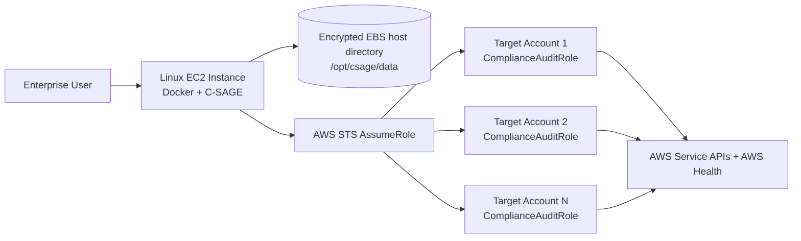

# C-SAGE Deployment Guide

**Platform:** C-SAGE — Cloud Security, Audit, Governance & Enforcement  
**Runtime:** Python 3.11 / Django 5.x / Gunicorn  
**Deployment Model:** Single Docker container on a Linux EC2 instance  
**Persistence Model:** Local JSON flat files on an EC2 host bind mount  
**Database:** None  
**S3 Runtime Dependency:** None

---

## 1. Target Architecture



C-SAGE does not require SQLite, PostgreSQL, RDS, S3 configuration storage, S3 suppression storage, Django migrations, database-backed sessions, or a locally maintained EOL/EOS catalog.

All C-SAGE state and cross-account configuration is stored on the EC2-mounted data directory. Lifecycle support dates are queried from AWS at scan time.

---

## 2. EC2 Baseline

Recommended starting point:

- Amazon Linux 2023 or another approved enterprise Linux distribution.
- Instance size: `t3.large` / `m6i.large` or equivalent for an initial deployment.
- Encrypted EBS storage using an approved customer-managed KMS key.
- EC2 instance profile for STS role assumption.
- Security group allowing application access only from approved enterprise networks or an internal reverse proxy/ALB.
- Outbound HTTPS access to AWS APIs.
- CloudWatch Agent or approved enterprise monitoring agent if required.

For larger account estates, increase CPU/memory based on account count, number of regions, and scan concurrency.

---

## 3. Install Docker and Git

Example for Amazon Linux 2023:

```bash
sudo dnf update -y
sudo dnf install -y docker git
sudo systemctl enable --now docker
sudo usermod -aG docker $USER
```

Log out and back in after adding the user to the Docker group, or run Docker with `sudo`.

Validate:

```bash
docker --version
git --version
```

---

## 4. Clone C-SAGE

```bash
sudo mkdir -p /opt/csage
sudo chown $USER:$USER /opt/csage
cd /opt/csage

git clone https://github.com/shankamal/AWS-C-SAGE.git app
cd app
```

---

## 5. Create Persistent Flat-File Storage

```bash
sudo mkdir -p /opt/csage/data
sudo chown -R $USER:$USER /opt/csage/data
chmod 750 /opt/csage/data
```

The container mounts this host directory at `/data`.

C-SAGE uses:

```text
/opt/csage/data/accounts.json
/opt/csage/data/scan_runs.json
/opt/csage/data/findings.json
/opt/csage/data/inventory.json
/opt/csage/data/suppressed_findings.json
```

`scan_runs.json`, `findings.json`, `inventory.json`, and `suppressed_findings.json` are created automatically.

Protect this directory because it contains cross-account IAM role mappings, scan evidence, and suppression history.

---

## 6. Configure Accounts and AssumeRole Details

Copy the example:

```bash
cp accounts.example.json /opt/csage/data/accounts.json
vi /opt/csage/data/accounts.json
```

Example:

```json
{
  "accounts": [
    {
      "account_id": "111122223333",
      "account_name": "Production",
      "role_arn": "arn:aws:iam::111122223333:role/ComplianceAuditRole",
      "external_id": "",
      "role_session_name": "CSAGEComplianceAudit",
      "duration_seconds": 3600,
      "regions": ["ap-south-1", "ap-south-2"]
    },
    {
      "account_id": "444455556666",
      "account_name": "UAT",
      "role_arn": "arn:aws:iam::444455556666:role/ComplianceAuditRole",
      "external_id": "",
      "role_session_name": "CSAGEComplianceAudit",
      "duration_seconds": 3600,
      "regions": ["ap-south-1"]
    }
  ]
}
```

Fields:

- `account_id`: 12-digit AWS account ID.
- `account_name`: display name in C-SAGE.
- `role_arn`: target cross-account audit role.
- `external_id`: optional STS External ID. Leave blank when not required.
- `role_session_name`: STS session name; defaults to `CSAGEComplianceAudit`.
- `duration_seconds`: requested role session duration. C-SAGE constrains this to 900–43200 seconds; the target role's MaxSessionDuration still applies.
- `regions`: regions to scan. If omitted/empty, C-SAGE discovers enabled regions.

C-SAGE does not read account or AssumeRole configuration from S3.

If `/data/accounts.json` is missing, empty, or unreadable, C-SAGE falls back to the EC2 instance profile/default Boto3 credential chain and scans the hosting AWS account.

---

## 7. Cross-Account IAM

### 7.1 EC2 instance profile

Attach a dedicated role such as:

```text
CSAGEApplicationRole
```

The baseline policy in `iam/CSAGEExecutionRolePolicy.json` requires `sts:AssumeRole` to the approved target `ComplianceAuditRole` roles.

For production, replace wildcard resources with explicit approved role ARNs where feasible.

### 7.2 Target account audit role

Create `ComplianceAuditRole` in every audited account and attach the baseline permissions from:

```text
iam/ComplianceAuditRolePolicy.json
```

The lifecycle scanner requires these additional read-only permissions:

```text
eks:DescribeClusterVersions
rds:DescribeDBEngineVersions
rds:DescribeDBMajorEngineVersions
health:DescribeEvents
health:DescribeEventDetails
health:DescribeAffectedEntities
```

Trust only the C-SAGE EC2 role.

Example trust policy:

```json
{
  "Version": "2012-10-17",
  "Statement": [
    {
      "Effect": "Allow",
      "Principal": {
        "AWS": "arn:aws:iam::<CSAGE_ACCOUNT_ID>:role/CSAGEApplicationRole"
      },
      "Action": "sts:AssumeRole"
    }
  ]
}
```

If `external_id` is used in `accounts.json`, add the corresponding `sts:ExternalId` condition to the target trust policy.

---

## 8. Resource Suppression Flat File

C-SAGE stores suppression decisions locally in:

```text
/opt/csage/data/suppressed_findings.json
```

The path can be changed with:

```text
CSAGE_SUPPRESSION_FILE=/data/suppressed_findings.json
```

A suppression record contains the deterministic finding key, suppressed/unsuppressed state, actor, reason, timestamps, rule/module, account, region, service, resource, severity and finding detail.

See `suppressed_findings.example.json` in the repository.

Suppressed findings remain visible in C-SAGE but are excluded from the open Non-Compliant count.

---

## 9. Runtime Environment Variables

Create `.env` from the example:

```bash
cp .env.example .env
vi .env
```

Important settings:

```text
DJANGO_DEBUG=false
DJANGO_SECRET_KEY=<strong-random-value>
DJANGO_ALLOWED_HOSTS=<EC2-private-ip>,<approved-hostname>
DJANGO_CSRF_TRUSTED_ORIGINS=https://<approved-hostname>

CSAGE_AUTH_USERNAME=csageadmin
CSAGE_AUTH_PASSWORD=<strong-password>
CSAGE_DATA_DIR=/data
CSAGE_ACCOUNTS_FILE=/data/accounts.json
CSAGE_SUPPRESSION_FILE=/data/suppressed_findings.json

AWS_DEFAULT_REGION=ap-south-1
CSAGE_EOL_WARNING_DAYS=30
```

`CSAGE_EOL_WARNING_DAYS` is only an alert threshold against AWS-published dates. It does not define EOL dates, versions or deprecated runtimes.

---

## 10. Build and Run

```bash
cd /opt/csage/app
docker build -t c-sage:latest .
```

Run:

```bash
docker run -d \
  --name c-sage \
  --restart unless-stopped \
  -p 8000:8000 \
  --env-file /opt/csage/app/.env \
  -v /opt/csage/data:/data \
  c-sage:latest
```

Check:

```bash
docker ps
docker logs c-sage
curl http://127.0.0.1:8000/healthz/
```

Expected health response:

```json
{"status":"ok","service":"C-SAGE","storage":"flat-file"}
```

---

## 11. AWS-Native Lifecycle / EOL / EOS Discovery

C-SAGE does not maintain a `lifecycle_rules.json` file.

### EKS

C-SAGE queries the EKS `DescribeClusterVersions` API for the Kubernetes version running on each cluster. AWS returns:

- current version support status
- end of standard support date
- end of extended support date

C-SAGE flags a cluster when end of standard support is reached or enters the configured warning window.

### RDS and Aurora

For open-source engines, C-SAGE queries `DescribeDBMajorEngineVersions`. AWS returns standard-support and, where applicable, extended-support lifecycle windows. The scan evaluates those AWS-provided dates directly.

### AWS Health Dashboard / API

C-SAGE also queries AWS Health scheduled-change events to detect AWS-published lifecycle notices for services that do not expose a dedicated support-date API. It examines deprecation, retirement, version, runtime, upgrade and end-of-support events plus their affected resources.

AWS Health Dashboard is available in the AWS console. Programmatic Health API access requires an eligible AWS Support plan. Accounts without API entitlement return `SubscriptionRequiredException`; C-SAGE records this as informational evidence and continues EKS/RDS service-native checks.

### Lambda runtime lifecycle

No deprecated Lambda runtime list is maintained in C-SAGE. Lambda runtime deprecation/EOS comes from AWS Health notices. Lambda VPC attachment compliance is still evaluated directly from the Lambda API.

---

## 12. Network and Security

Recommended controls:

- Keep EC2 in a private subnet where possible.
- Expose C-SAGE only through approved corporate connectivity or an internal ALB/reverse proxy.
- Use HTTPS for production access.
- Restrict port `8000` to the reverse proxy/ALB or approved management ranges.
- Use IMDSv2 for EC2 instance metadata.
- Encrypt EBS with an approved CMEK.
- Restrict SSH and prefer AWS Systems Manager Session Manager where permitted.
- Protect `/opt/csage/data` with least-privilege Linux ownership and mode `750` or stricter.
- Do not put static AWS access keys in `.env` or flat files.

C-SAGE obtains AWS credentials from the EC2 instance profile and uses STS temporary credentials for target accounts.

---

## 13. Backup and Recovery

Back up the persistent data directory because it contains audit state and governance configuration:

```text
/opt/csage/data
```

Recommended options:

- EBS snapshots / AWS Backup for the EC2 data volume.
- Filesystem-level backup to an approved enterprise backup destination.
- Retain copies according to audit evidence retention requirements.

Minimum files to protect:

```text
accounts.json
scan_runs.json
findings.json
inventory.json
suppressed_findings.json
```

A restore consists of restoring `/opt/csage/data`, rebuilding/pulling the container image, and starting the container with the same bind mount.

---

## 14. Upgrade and Rollback

Upgrade:

```bash
cd /opt/csage/app
git pull
docker build -t c-sage:new .
docker stop c-sage
docker rm c-sage

docker run -d \
  --name c-sage \
  --restart unless-stopped \
  -p 8000:8000 \
  --env-file /opt/csage/app/.env \
  -v /opt/csage/data:/data \
  c-sage:new
```

The persistent data remains outside the container.

For rollback, stop the new container and start the previous image using the same `/opt/csage/data:/data` bind mount.

---

## 15. Validation Checklist

- [ ] Docker service is running.
- [ ] C-SAGE container is healthy.
- [ ] `/healthz/` returns `200`.
- [ ] `/opt/csage/data` is mounted to `/data`.
- [ ] `accounts.json` contains all approved Account IDs and Role ARNs.
- [ ] Optional External IDs match target role trust policies.
- [ ] EC2 instance profile can assume every configured target role.
- [ ] Target roles are read-only and include EKS/RDS/AWS Health lifecycle read permissions.
- [ ] First audit scan completes.
- [ ] `scan_runs.json`, `findings.json`, and `inventory.json` are created.
- [ ] EKS lifecycle findings show AWS-provided support dates.
- [ ] RDS lifecycle findings show AWS-provided lifecycle dates where supported.
- [ ] AWS Health scheduled-change findings appear when Health API access is available.
- [ ] Suppressing a finding creates/updates `suppressed_findings.json` with resource and actor details.
- [ ] Suppressed findings remain visible but are removed from open non-compliance totals.
- [ ] CSV/XLSX exports work.
- [ ] EBS encryption and backup controls are enabled.
- [ ] Access to `/opt/csage/data` is restricted.

---

## 16. Operational Evidence to Retain

For audit readiness retain:

- approved `accounts.json` versions
- target-role trust policies
- C-SAGE EC2 instance-profile policy
- CloudTrail STS `AssumeRole` events
- scan exports
- AWS-native lifecycle findings and AWS Health event evidence captured in findings
- `suppressed_findings.json` history/backups
- EBS encryption evidence
- EC2/data-volume backup evidence
- deployment/change tickets and release commit SHA

This provides an auditable chain from configured account access through AWS-native lifecycle evidence, compliance findings and approved suppressions without relying on a database, S3 application state or manually maintained EOL catalog.
