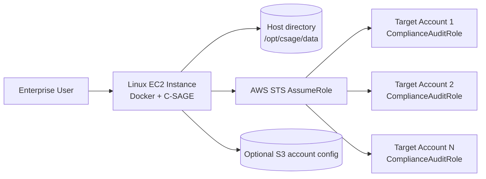

# C-SAGE Deployment Guide

**Platform:** C-SAGE — Cloud Security, Audit, Governance & Enforcement  
**Runtime:** Python 3.11 / Django 5.x / Gunicorn  
**Deployment Model:** Single Docker container on a Linux EC2 instance  
**Persistence Model:** Local JSON flat files on an EC2 host bind mount  
**Database:** None

---

## 1. Target Architecture



C-SAGE does not require SQLite, PostgreSQL, RDS, Django migrations, or database-backed sessions. Application state is persisted as JSON files in the mounted data directory.

---

## 2. EC2 Baseline

Recommended starting point:

- Amazon Linux 2023 or another approved enterprise Linux distribution.
- Instance size: `t3.large` / `m6i.large` or equivalent for an initial deployment.
- Encrypted EBS root/data volume using an approved KMS key.
- EC2 instance profile with the C-SAGE execution permissions.
- Security group allowing application access only from approved enterprise networks or a reverse proxy/ALB.
- Outbound HTTPS access to required AWS APIs.
- CloudWatch Agent or approved enterprise logging/monitoring agent if required.

For larger account estates, increase CPU/memory based on account count, number of regions, and scan concurrency.

---

## 3. Install Docker and Git

Example for Amazon Linux 2023:

```bash
sudo dnf update -y
sudo dnf install -y docker git
sudo systemctl enable --now docker
sudo usermod -aG docker $USER
```

Log out and back in after adding the user to the Docker group, or run Docker with `sudo`.

Validate:

```bash
docker --version
git --version
```

---

## 4. Clone C-SAGE

```bash
sudo mkdir -p /opt/csage
sudo chown $USER:$USER /opt/csage
cd /opt/csage

git clone https://github.com/shankamal/AWS-C-SAGE.git app
cd app
```

---

## 5. Create Persistent Flat-File Storage

Create the host directory that will survive container restarts and image upgrades:

```bash
sudo mkdir -p /opt/csage/data
sudo chown -R $USER:$USER /opt/csage/data
chmod 750 /opt/csage/data
```

The container mounts this host directory at `/data`.

C-SAGE will use the following files:

```text
/opt/csage/data/accounts.json
/opt/csage/data/lifecycle_rules.json
/opt/csage/data/scan_runs.json
/opt/csage/data/findings.json
/opt/csage/data/inventory.json
/opt/csage/data/suppressed_findings.json
```

`scan_runs.json`, `findings.json`, `inventory.json`, and `suppressed_findings.json` are created automatically.

---

## 6. Configure Accounts

Copy the example:

```bash
cp accounts.example.json /opt/csage/data/accounts.json
vi /opt/csage/data/accounts.json
```

Example:

```json
{
  "accounts": [
    {
      "account_id": "111122223333",
      "account_name": "Production",
      "role_arn": "arn:aws:iam::111122223333:role/ComplianceAuditRole",
      "regions": ["ap-south-1", "ap-south-2"]
    },
    {
      "account_id": "444455556666",
      "account_name": "UAT",
      "role_arn": "arn:aws:iam::444455556666:role/ComplianceAuditRole",
      "regions": ["ap-south-1"]
    }
  ]
}
```

Account resolution order is:

1. S3 configuration when `COMPLIANCE_CONFIG_S3_BUCKET` is set.
2. `/data/accounts.json` or the file configured in `CSAGE_ACCOUNTS_FILE`.
3. The EC2 instance profile / default Boto3 credential chain for the current account.

---

## 7. Configure Lifecycle/EOL Rules

Create:

```bash
vi /opt/csage/data/lifecycle_rules.json
```

Example:

```json
{
  "rules": [
    {
      "service": "eks",
      "engine": "kubernetes",
      "version": "1.30",
      "eol_date": "2026-11-26",
      "active": true,
      "source_reference": "https://docs.aws.amazon.com/eks/latest/userguide/kubernetes-versions.html",
      "notes": "Maintain against approved lifecycle source"
    }
  ]
}
```

Use approved AWS lifecycle/EOL dates and update this file through the normal operational change process.

---

## 8. Configure Environment Variables

Create the environment file:

```bash
cp .env.example .env
vi .env
```

Minimum production values:

```text
DJANGO_DEBUG=false
DJANGO_SECRET_KEY=<strong-random-secret>
DJANGO_ALLOWED_HOSTS=<EC2-private-IP>,<approved-hostname>
DJANGO_CSRF_TRUSTED_ORIGINS=https://<approved-hostname>

CSAGE_AUTH_USERNAME=<admin-user>
CSAGE_AUTH_PASSWORD=<strong-password>
CSAGE_DATA_DIR=/data
CSAGE_ACCOUNTS_FILE=/data/accounts.json
CSAGE_LIFECYCLE_FILE=/data/lifecycle_rules.json
CSAGE_SUPPRESSION_FILE=/data/suppressed_findings.json

AWS_DEFAULT_REGION=ap-south-1
```

There is no `DATABASE_URL`.

For a temporary local test only, authentication can be disabled with:

```text
CSAGE_DISABLE_AUTH=true
```

Do not disable authentication in production.

---

## 9. EC2 IAM Role

Attach an instance profile to the C-SAGE EC2 instance.

The role should permit only what C-SAGE requires, including:

- `sts:AssumeRole` to approved target `ComplianceAuditRole` roles.
- S3 read access only when S3 account configuration is used.
- Read/list API permissions required for the current AWS account when scanning without cross-account role assumption.

Use `iam/CSAGEExecutionRolePolicy.json` as the starting point and restrict resource ARNs for the target environment.

Each target AWS account should contain `ComplianceAuditRole` with the read-only permissions in `iam/ComplianceAuditRolePolicy.json` and a trust relationship to the C-SAGE EC2 role.

---

## 10. Build the Docker Image

```bash
cd /opt/csage/app
docker build -t c-sage:latest .
```

Optional validation:

```bash
docker image inspect c-sage:latest >/dev/null
```

---

## 11. Run C-SAGE

```bash
docker run -d \
  --name c-sage \
  --restart unless-stopped \
  -p 8000:8000 \
  --env-file /opt/csage/app/.env \
  -v /opt/csage/data:/data \
  c-sage:latest
```

Check status:

```bash
docker ps
docker logs -f c-sage
```

Health check:

```bash
curl http://127.0.0.1:8000/healthz/
```

Expected response:

```json
{"status":"ok","service":"C-SAGE","storage":"flat-file"}
```

---

## 12. Access the Application

Browse to:

```text
http://<EC2-IP>:8000
```

The browser will request HTTP Basic credentials configured using:

```text
CSAGE_AUTH_USERNAME
CSAGE_AUTH_PASSWORD
```

For production, prefer one of these patterns:

- Internal ALB with HTTPS/ACM in front of EC2.
- Enterprise reverse proxy.
- Enterprise SSO/authentication gateway in front of C-SAGE.

Do not expose port `8000` directly to the public internet.

---

## 13. Persistent File Behaviour

After a successful scan C-SAGE writes:

- `scan_runs.json` — scan history and summary counts.
- `findings.json` — latest control-level findings.
- `inventory.json` — latest consolidated resource inventory.
- `suppressed_findings.json` — suppression state, actor, reason, and timestamp.

The application uses atomic file replacement and Linux file locking for writes.

Recommended permissions:

```bash
chmod 750 /opt/csage/data
chmod 640 /opt/csage/data/*.json
```

Do not place credentials or AWS secret keys in these JSON files.

---

## 14. Backup and Restore

Back up the host data directory regularly:

```bash
sudo tar -czf /opt/csage/csage-data-$(date +%Y%m%d-%H%M).tar.gz /opt/csage/data
```

A production implementation can use:

- EBS snapshots.
- AWS Backup for the EBS volume.
- Scheduled encrypted copy of the JSON files to an approved S3 bucket.

Restore by stopping the container, restoring `/opt/csage/data`, and starting the container again.

```bash
docker stop c-sage
# restore files
docker start c-sage
```

---

## 15. Upgrade Procedure

```bash
cd /opt/csage/app
git pull

docker build -t c-sage:latest .
docker stop c-sage
docker rm c-sage

docker run -d \
  --name c-sage \
  --restart unless-stopped \
  -p 8000:8000 \
  --env-file /opt/csage/app/.env \
  -v /opt/csage/data:/data \
  c-sage:latest
```

No database migration step is required.

---

## 16. Rollback

Before an upgrade, retain the previous image with a version tag:

```bash
docker tag c-sage:latest c-sage:previous
```

Rollback:

```bash
docker stop c-sage
docker rm c-sage

docker run -d \
  --name c-sage \
  --restart unless-stopped \
  -p 8000:8000 \
  --env-file /opt/csage/app/.env \
  -v /opt/csage/data:/data \
  c-sage:previous
```

The same `/opt/csage/data` directory is reused.

---

## 17. Validation Checklist

- [ ] EC2 instance profile is attached.
- [ ] Docker service is running.
- [ ] `/opt/csage/data` exists and is writable by the container.
- [ ] `accounts.json` contains the correct account IDs and role ARNs.
- [ ] Target account trust policies permit the C-SAGE EC2 role.
- [ ] `lifecycle_rules.json` contains the approved lifecycle catalogue.
- [ ] Strong Basic Auth credentials are configured.
- [ ] C-SAGE container is healthy.
- [ ] `/healthz/` returns HTTP 200.
- [ ] First compliance scan completes.
- [ ] `findings.json` is created.
- [ ] `inventory.json` is created.
- [ ] Suppression/unsuppression persists after container restart.
- [ ] CSV/Excel exports work.
- [ ] EC2 security group is restricted to approved sources.
- [ ] EBS backup/snapshot policy covers `/opt/csage/data`.

---

## 18. Troubleshooting

### Container cannot write files

```bash
ls -ld /opt/csage/data
sudo chown -R $USER:$USER /opt/csage/data
```

### C-SAGE returns 503 authentication configuration error

Set both:

```text
CSAGE_AUTH_USERNAME
CSAGE_AUTH_PASSWORD
```

and restart the container.

### No accounts are scanned

Validate in this order:

```bash
cat /opt/csage/data/accounts.json
aws sts get-caller-identity
```

Then verify target `ComplianceAuditRole` trust policies.

### Scan fails with AccessDenied

Review the EC2 instance role, target account audit role, SCPs, permission boundaries, and CloudTrail `AssumeRole` events.

### Data disappears after container replacement

Confirm the bind mount exists:

```bash
docker inspect c-sage | grep -A5 Mounts
```

The container must be started with:

```text
-v /opt/csage/data:/data
```

---

## 19. Audit Evidence to Retain

For operational and RBI/audit readiness, retain:

- Approved EC2 architecture and security group configuration.
- EC2 IAM role and target `ComplianceAuditRole` policies/trust relationships.
- Approved `accounts.json` configuration history.
- Approved `lifecycle_rules.json` changes.
- `scan_runs.json`, `findings.json`, and exported reports.
- `suppressed_findings.json` with suppression reasons and actors.
- EBS backup/snapshot evidence.
- Container image/version and deployment change ticket.
- CloudTrail evidence for `AssumeRole` activity.

C-SAGE is therefore deployable as a self-contained Docker workload on a Linux EC2 instance with no external database dependency.
