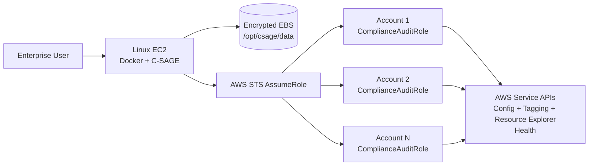

# C-SAGE Deployment Guide

**Platform:** C-SAGE — Cloud Security, Audit, Governance & Enforcement  
**Runtime:** Python 3.11 / Django 5.x / Gunicorn  
**Deployment Model:** Single Docker container on Linux EC2  
**Persistence:** Local JSON flat files on encrypted EBS bind mount  
**Database:** None  
**S3 Application-State Dependency:** None

---

## 1. Target Architecture



C-SAGE stores its own state only on the mounted EC2 data directory. AWS resources are discovered at scan time through read-only APIs.

---

## 2. EC2 Baseline

Recommended starting point:

- Amazon Linux 2023 or approved enterprise Linux.
- `m6i.large`/equivalent as a practical initial size; increase CPU/memory for large estates.
- Encrypted EBS using an approved KMS key.
- EC2 instance profile `CSAGEApplicationRole`.
- Outbound HTTPS to AWS service endpoints.
- Restricted inbound access, preferably through an internal ALB/reverse proxy.
- IMDSv2 required.

Complete multi-account inventory can make many read/list API calls. Size the instance, scan timeout and API concurrency for the number of accounts and Regions being scanned.

---

## 3. Install Docker and Git

```bash
sudo dnf update -y
sudo dnf install -y docker git
sudo systemctl enable --now docker
sudo usermod -aG docker $USER
```

Log out/in after the Docker-group change if needed.

---

## 4. Clone C-SAGE

```bash
sudo mkdir -p /opt/csage
sudo chown $USER:$USER /opt/csage
cd /opt/csage

git clone https://github.com/shankamal/AWS-C-SAGE.git app
cd app
cp .env.example .env
```

---

## 5. Configure Accounts

```bash
sudo mkdir -p /opt/csage/data
cp accounts.example.json /opt/csage/data/accounts.json
vi /opt/csage/data/accounts.json
```

Example:

```json
{
  "accounts": [
    {
      "account_id": "111122223333",
      "account_name": "Production",
      "role_arn": "arn:aws:iam::111122223333:role/ComplianceAuditRole",
      "external_id": "",
      "role_session_name": "CSAGEComplianceAudit",
      "duration_seconds": 3600,
      "regions": ["ap-south-1", "ap-south-2"]
    }
  ]
}
```

If `regions` is empty, C-SAGE attempts to discover enabled Regions with EC2 `DescribeRegions`.

---

## 6. IAM Roles

### 6.1 CSAGEApplicationRole

Attach `CSAGEApplicationRole` to the EC2 instance. Its trust relationship allows EC2 to assume it. Its permissions policy allows only `sts:AssumeRole` into approved target roles.

Repository baseline:

```text
iam/CSAGEExecutionRolePolicy.json
```

For production, replace wildcard account resources with explicit target-role ARNs.

### 6.2 ComplianceAuditRole

Create `ComplianceAuditRole` in each target account and attach:

```text
iam/ComplianceAuditRolePolicy.json
```

The policy is read-only and covers the inventory/compliance APIs used by C-SAGE, including EC2/networking, ELB, containers, databases, storage, IAM/KMS metadata, monitoring/integration, Config, Tagging API, Resource Explorer and lifecycle APIs.

C-SAGE deliberately does **not** require secret-value retrieval such as `secretsmanager:GetSecretValue`.

Trust only the C-SAGE EC2 role:

```json
{
  "Version": "2012-10-17",
  "Statement": [
    {
      "Effect": "Allow",
      "Principal": {
        "AWS": "arn:aws:iam::<CSAGE_ACCOUNT_ID>:role/CSAGEApplicationRole"
      },
      "Action": "sts:AssumeRole"
    }
  ]
}
```

If `external_id` is configured, add the matching `sts:ExternalId` trust condition.

### 6.3 Broad-discovery dependencies

C-SAGE still scans with explicit service APIs if these are unavailable, but completeness is improved when:

- AWS Config is enabled/recording applicable resource types.
- AWS Resource Explorer 2 has an index and usable/default view in the Regions being queried.

Missing permissions or unavailable broad-discovery sources are recorded in Master Inventory Coverage rather than treated as zero resources.

---

## 7. Runtime Environment

Important `.env` settings:

```text
DJANGO_DEBUG=false
DJANGO_SECRET_KEY=<strong-random-value>
DJANGO_ALLOWED_HOSTS=<approved-hostname-or-ip>
DJANGO_CSRF_TRUSTED_ORIGINS=https://<approved-hostname>
DJANGO_CSRF_COOKIE_SECURE=true
DJANGO_SECURE_SSL_REDIRECT=true

CSAGE_AUTH_USERNAME=csageadmin
CSAGE_AUTH_PASSWORD=<strong-password>
CSAGE_DATA_DIR=/data
CSAGE_ACCOUNTS_FILE=/data/accounts.json
CSAGE_SUPPRESSION_FILE=/data/suppressed_findings.json
CSAGE_SCAN_HISTORY_LIMIT=50
CSAGE_MAX_WORKERS=8
CSAGE_EOL_WARNING_DAYS=30
AWS_DEFAULT_REGION=ap-south-1
```

For temporary direct HTTP testing only:

```text
DJANGO_CSRF_COOKIE_SECURE=false
DJANGO_SECURE_SSL_REDIRECT=false
DJANGO_CSRF_TRUSTED_ORIGINS=http://<EC2-PUBLIC-IP>:8000
```

---

## 8. Build the Image and Fix Data-Directory Ownership

```bash
cd /opt/csage/app
docker build -t c-sage:latest .
```

The image runs as a non-root `csage` user. Determine its numeric UID/GID and make the host bind mount writable by that identity:

```bash
CSAGE_UID=$(docker run --rm c-sage:latest id -u)
CSAGE_GID=$(docker run --rm c-sage:latest id -g)

sudo chown -R ${CSAGE_UID}:${CSAGE_GID} /opt/csage/data
sudo chmod 750 /opt/csage/data
sudo find /opt/csage/data -type f -exec chmod 640 {} \;
```

This avoids errors such as:

```text
Permission denied: '/data/.csage.lock'
```

---

## 9. Run C-SAGE

Standard bind mount:

```bash
docker run -d \
  --name c-sage \
  --restart unless-stopped \
  -p 8000:8000 \
  --env-file /opt/csage/app/.env \
  -v /opt/csage/data:/data \
  c-sage:latest
```

On an SELinux-enforcing host use a relabeled bind mount when required:

```bash
docker run -d \
  --name c-sage \
  --restart unless-stopped \
  -p 8000:8000 \
  --env-file /opt/csage/app/.env \
  -v /opt/csage/data:/data:Z \
  c-sage:latest
```

Verify write access:

```bash
docker exec c-sage sh -c 'touch /data/.write-test && rm /data/.write-test && echo WRITE_OK'
```

Health check:

```bash
curl http://127.0.0.1:8000/healthz/
```

Expected:

```json
{"status":"ok","service":"C-SAGE","storage":"flat-file"}
```

---

## 10. Persistent Files

After a scan, `/opt/csage/data` contains:

```text
accounts.json
scan_runs.json
findings.json
inventory.json
inventory_coverage.json
suppressed_findings.json
```

`inventory.json` is the latest rich resource snapshot. `inventory_coverage.json` proves which account/Region/service/resource-type checks were attempted and distinguishes zero resources from access or API failures.

Protect and back up this directory as audit evidence.

---

## 11. Master Inventory Validation

Run an Audit Scan and open **Master Inventory**.

Validate that:

- resources appear across every configured account;
- service and Region filters work;
- global services such as IAM/Route 53/Organizations appear when authorized;
- individual **View**, **Excel** and **JSON** actions work;
- the Coverage table includes rows whose resource count is zero;
- `ACCESS_DENIED`, `UNAVAILABLE` or `ERROR` entries are visible rather than hidden;
- `/data/inventory_coverage.json` is created;
- the full Excel export contains Inventory Summary, Master Inventory, Service Coverage and Resource Attributes sheets.

The Resource Attributes sheets retain nested API data as flattened section/path/value rows instead of summarizing it.

---

## 12. Inventory Completeness Interpretation

AWS has no universal API that guarantees every provisioned resource plus every service-specific attribute. C-SAGE therefore combines four layers:

1. service-native list/describe APIs;
2. AWS Config query/enrichment;
3. Resource Groups Tagging API;
4. AWS Resource Explorer 2 broad discovery.

A resource/source not visible because of IAM, Region support, Config coverage or Resource Explorer setup is surfaced as a coverage limitation. A service is considered genuinely empty only when an applicable collector completed successfully and returned count `0`.

Deleted-resource metadata is exported only when the AWS source API still exposes it.

---

## 13. Lifecycle / EOL / EOS

C-SAGE does not maintain lifecycle-rule files.

- EKS lifecycle dates come from `DescribeClusterVersions`.
- Supported RDS/Aurora lifecycle periods come from RDS lifecycle APIs.
- Other AWS-published deprecation/retirement notices come from AWS Health scheduled-change events when Health API access is available.

`CSAGE_EOL_WARNING_DAYS` is an alert threshold only.

---

## 14. Backup and Recovery

Back up:

```text
/opt/csage/data
```

Recommended mechanisms are encrypted EBS snapshots/AWS Backup or an approved enterprise filesystem backup.

A restore consists of restoring the data directory, rebuilding/pulling the application image, restoring correct host-directory UID/GID ownership and starting the container with the same bind mount.

---

## 15. Upgrade

```bash
cd /opt/csage/app
git pull

docker build -t c-sage:new .
CSAGE_UID=$(docker run --rm c-sage:new id -u)
CSAGE_GID=$(docker run --rm c-sage:new id -g)
sudo chown -R ${CSAGE_UID}:${CSAGE_GID} /opt/csage/data

docker stop c-sage
docker rm c-sage

docker run -d \
  --name c-sage \
  --restart unless-stopped \
  -p 8000:8000 \
  --env-file /opt/csage/app/.env \
  -v /opt/csage/data:/data:Z \
  c-sage:new
```

Use `:Z` only where SELinux relabeling is required.

---

## 16. Validation Checklist

- [ ] C-SAGE container is healthy.
- [ ] `/data` is writable by the non-root container user.
- [ ] All approved accounts and AssumeRole ARNs are present in `accounts.json`.
- [ ] `CSAGEApplicationRole` can assume every target `ComplianceAuditRole`.
- [ ] Target audit roles use the current `iam/ComplianceAuditRolePolicy.json`.
- [ ] Audit scan completes.
- [ ] `inventory.json` and `inventory_coverage.json` are created.
- [ ] Master Inventory can browse individual resources.
- [ ] Per-resource JSON and Excel exports work.
- [ ] Full formatted Excel export works.
- [ ] Zero-resource services/types appear in coverage evidence.
- [ ] Access-denied/unavailable discovery sources are visible.
- [ ] Compliance findings and suppressions still operate.
- [ ] EBS encryption and data-directory backups are enabled.

---

## 17. Operational Evidence to Retain

Retain:

- approved `accounts.json` versions;
- target-role trust and permission policies;
- CloudTrail STS `AssumeRole` events;
- `inventory.json` and `inventory_coverage.json` snapshots/backups;
- exported Master Inventory workbooks;
- compliance findings and AWS-native lifecycle evidence;
- suppression history;
- EBS encryption/backup evidence;
- deployment/change ticket and release commit SHA.
